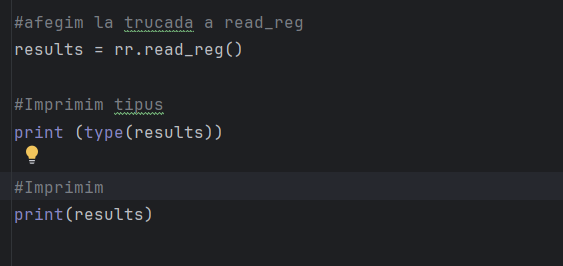
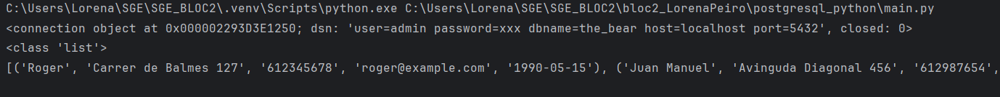
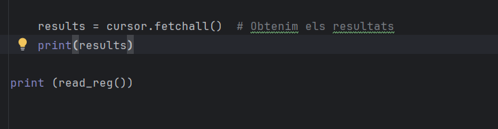
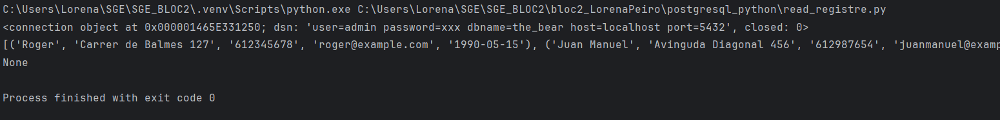

**PAS LISTS**

Des del main fem les trucades a read_registre per imprimir tipus i la llista

El resultat és el següent:

Ara des del read_registre probem a imprimir la llista de totes les dades

La sortida és:

