**PAS LISTS**

Des del main fem les trucades a read_registre per imprimir tipus i la llista

El resultat és el següent:

Ara des del read_registre probem a imprimir la llista de totes les dades

La sortida és:

Extreiem el registre de id_cliente = 5

I ara imprimirem el telèfon del id_cliente = 5

La sortida es la següent:

Ara extreurem, per acabar aquest pas, les següents dades:

1. Les dades de l’Andreu
2. El correu de l’Andreu
3. Les dades de la Vivian
4. La direcció de la Vivian
5. Les dades de l’Albert
6. La data de cumpleanys de l’Albert

La sortida és la següent:

**PAS MAIN.PY**

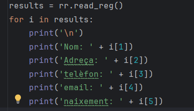

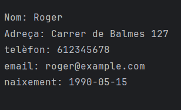

**PAS UPDATE.PY**

Modifiquem el teléfon de 3 clients diferents

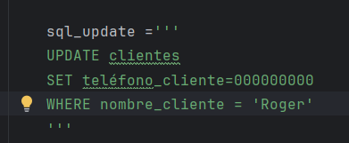

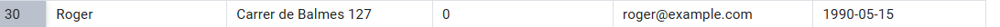

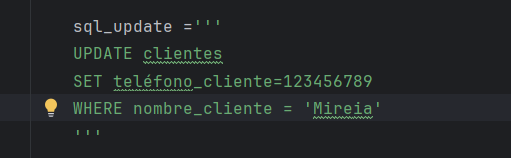

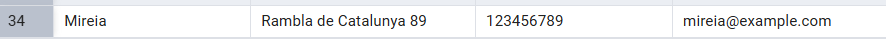

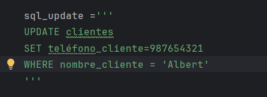

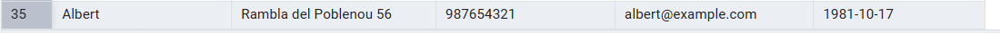

**PAS DELETE.PY**

Eliminem el registre de 3 clients

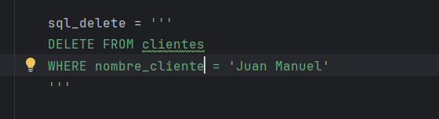

- Abans de l'eliminació:

  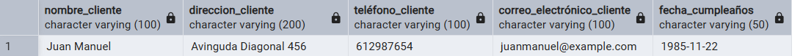

- Desprès de l'eliminació:

    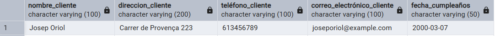

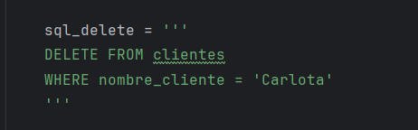

- Abans de l'eliminació:

  

- Desprès de l'eliminació:

    

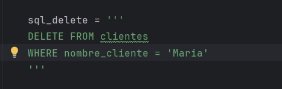

- Abans de l'eliminació:

  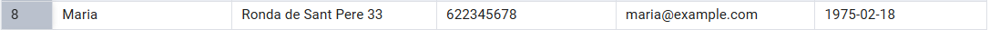

- Desprès de l'eliminació:

    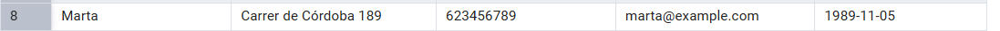
